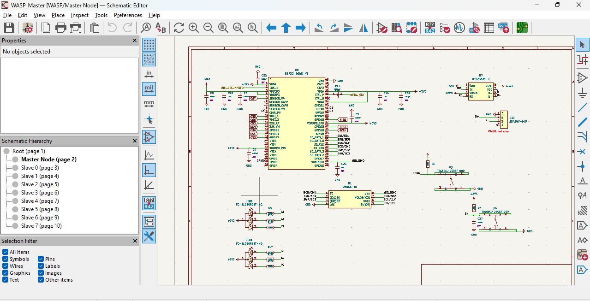

Notes: `Notes: I only made small progress each day since summer ended early here and I don’t really have much time in one day. I felt it wasn’t worth writing a separate entry for each day, so I decided to combine them into a few bigger journal entries instead.`

# July 3rd: Kick Off & Slave Template

Since I want to make 8 identical ESP32 slave boards, I decided to start by making one template first. I worked on the power part for it and double-checked everything because I don’t want to repeat the same mistake 8 times later. This is also my first time making a PCB, so I had to figure out a lot of things — from learning the techniques to searching for all the components I’ll use and other related stuff.

**Total time spent: 5h**

---

# July 8th: SPI + Master ESP32

I started working on the master ESP32 for the central computer that will control everything, receive the CSI data from all the slave boards, and send back the calibrated CSI. I also set up the SPI communication for it.

**Total time spent: 3h**

---

# July 11th: Buffers and RF Parts

Today I worked on clock buffers, other buffers, and some RF parts. Since this is my first PCB project, I had to do a lot more reading to understand how these work. I ended up researching again because there were so many different methods and opinions on what I should use for this case, which made it take even more time.

**Total time spent: 3h**

---

# July 18th: Starting the PCB Layout

I finally opened KiCad to start making the PCB layout. I spent a lot of time just learning the basic controls since I’ve never done this before. By the end, I managed to start placing some components.

**Total time spent: 2h**

---

# July 30th: Finished Placing Components

I completed placing all the components on the board. It took rly long because I kept adjusting the positions to make the layout better. I also had to arrange some of the components with precise measurements so the calibration process for the CSI will be easier later.

**Total time spent: 8h**

---

# July : Routing & Finishing

I started routing the board, and it was really hard than I expected lol. Sometimes a trace would block another, so I had to keep moving things around. When I got to the finishing part, I ran the DRC check and saw that there were a lot of errors, so now I need to revise quite a few things (not just the PCB layout, but also parts of the schematic huhu).

**Total time spent: 4h**
